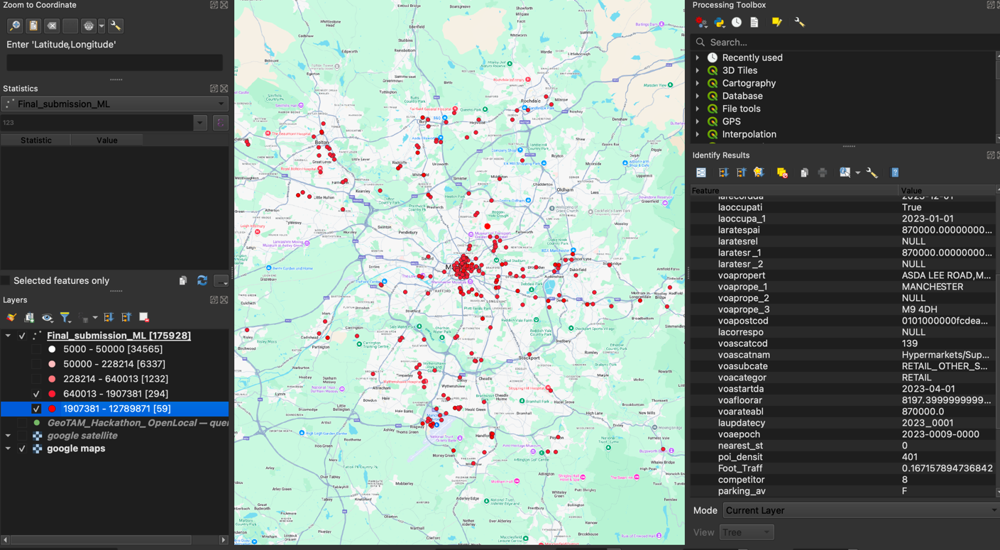
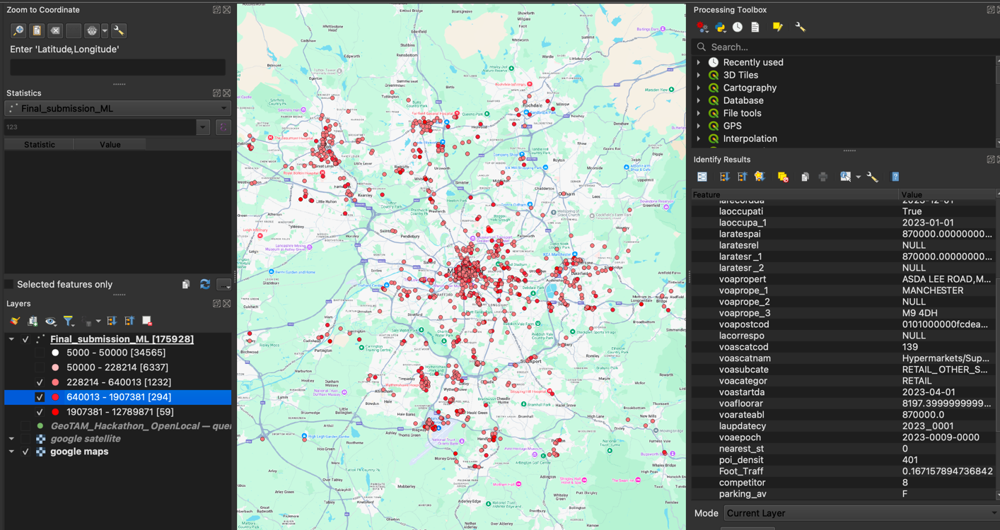

### **Predicting Business Turnover Using Geospatial and Business Data**

### **Contents**

1. [Introduction: The Problem We Solved](#introduction-the-problem-we-solved)
2. [Storytelling: A Journey into Predicting Economic Potential](#storytelling-a-journey-into-predicting-economic-potential)
3. [Our Approach: From Data to Predictions](#our-approach-from-data-to-predictions)
4. [Key Results: Data-Driven Insights](#key-results-data-driven-insights)
5. [Challenges and How We Overcame Them](#challenges-and-how-we-overcame-them)
6. [How to Run the Code](#how-to-run-the-code)
7. [Future Plans](#future-plans)
8. [Conclusion: Unlocking Business Potential](#conclusion-unlocking-business-potential)
9. [Team Members](#team-members)

### **Introduction: The Problem We Solved**

Business turnover prediction is crucial for informed decision-making by stakeholders like entrepreneurs, investors, and
policymakers. However, predicting turnover accurately is a complex task that involves multiple interdependent factors
such as location, rateable value, competition, and business type.

Our goal was to leverage geospatial data and business metrics to build a predictive model for business turnover. The
challenge required us to extract insights from the OpenLocal dataset, optimize feature weights, and use clustering
algorithms to make predictions without explicit ground truth data for turnover.

---

### **Storytelling: A Journey into Predicting Economic Potential**

Imagine a bustling city filled with diverse businesses — retail stores, offices, restaurants, and industries. Each
contributes to the economy, but how do we identify the top-performing businesses or potential hotspots for growth?

Our team envisioned a solution where data would tell the story of success. By combining geospatial analysis with
business data, we built a robust pipeline that maps out not only where businesses are located but also how they perform.
With predictive insights, our model shines a light on economic potential — a step toward empowering decision-makers with
actionable intelligence.

---

### **Our Approach: From Data to Predictions**

To predict turnover effectively, we combined location-based features with business attributes using a multi-step
pipeline:

1. **Geospatial Data Processing**:
    - **Dataset Used**: OpenLocal GeoPackage file.
    - We processed geospatial data to ensure all geometries were consistent (EPSG:27700 projection).

2. **Feature Engineering**:  
   We identified the following critical features for turnover prediction:
    - **`poi_density`**: Density of nearby points of interest (POIs), calculated using an optimized spatial index within
      the certain radius (in our code we have taken: 1 KM buffer)
    - **`rateable_value`**: The annual VOA rental valuation for businesses.
    - **`competitor_count`**: Number of competitors in a defined radius, penalized non-linearly within
      the certain radius (in our code we have taken: 1 KM buffer)
    - **`Foot_Traffic_Index`**: A normalized index derived from POI density to represent potential foot traffic.
    - **`nearest_station_distance`**: Distance to the nearest public transit station, incorporated with an exponential
      decay.
    - **`parking_available`**: Binary indicator of nearby parking availability within radius r.
    - **`laratespaid`**: Rates paid annually by businesses, used as a proxy for financial capacity.
    - **`final_multiplier`**: Combines weighted multipliers for both business categories (`voacategory`) and
      subcategories (`voasubcategory`) to better reflect turnover variability.

3. **Clustering Algorithms**:
    - We implemented **DBSCAN** and **Gaussian Mixture Models (GMM)** to cluster businesses based on the above features.
      Clustering helped identify patterns in business turnover based on similar characteristics.

4. **Feature Weight Optimization**:  
   Using **Random Forest Regression**, we derived feature importances to assign weights for calculating the **optimized
   turnover proxy**.

5. **Turnover Prediction Formula**:  
   The final turnover proxy calculation incorporated weighted contributions of all features:

   ```python
   business_locations['optimized_turnover_proxy'] = (
       1.5 * business_locations['adjusted_rateable_value'] * business_locations['final_multiplier'] +
       1.5 * np.log1p(business_locations['Foot_Traffic_Index'] + 1e-6) +
       1.2 * np.exp(-0.1 * business_locations['nearest_station_distance'].clip(upper=5000)) +
       1.5 * business_locations['parking_available'] +
       1.0 * (1 / (np.sqrt(business_locations['competitor_count']) + 1)) +
       0.5 * (business_locations['adjusted_rateable_value'] / (business_locations['voafloorarea'] + 1)) +
       0.7 * business_locations['laratespaid']
   )
   ```

   #### Key Considerations:
    - **Exponential Decay (`np.exp`)**: Models the reduced impact of distant transit stations.
    - **Logarithmic Scaling (`np.log1p`)**: Handles wide-ranging foot traffic data while minimizing outlier effects.
    - **Non-linear Competitor Penalty (`np.sqrt`)**: Diminishes the impact of large competitor counts, reflecting
      saturation effects.


6. **Parallelized Processing**:  
   Large-scale geospatial computations, such as POI density and competitor count, were parallelized using Python's
   `concurrent.futures` for efficient execution.

7. **Visualization**:
    - **DBSCAN Clustering**: Visualized POI density vs. rateable value across clusters.
    - **Predicted Turnover vs. Rateable Value**: Showed patterns and consistency between rateable values and predicted
      turnover.

---




### **Key Results: Data-Driven Insights**

- **Predicted Turnover Patterns**: Turnover predictions aligned with real-world trends. Businesses with higher rateable
  values and category multipliers (e.g., retail and leisure) showed significantly higher turnover.
- **Cluster-Based Insights**:
    - Cluster 2 (GMM): Represented businesses with the highest turnovers.
    - Cluster 0 (DBSCAN): Highlighted outliers with unique characteristics, such as businesses with medium turnover
- **Feature Importances**: Rateable value was the most significant predictor, followed by competitor count, foot traffic
  index, and rates paid.

---

### **Challenges and How We Overcame Them**

1. **Lack of Ground Truth**:
    - With no explicit turnover data, we used rateable value, laratespaid etc. as a proxy and weighted other features
      dynamically.

2. **Computational Complexity**:
    - Geospatial computations like POI density and competitor counts were optimized using spatial indexing (`rtree`) and
      parallel processing.

3. **Outlier Management**:
    - Clustering algorithms helped identify outliers and ensure their influence was appropriately managed during
      prediction.

---

### **How to Run the Code**

1. **Install Required Libraries**:
   ```bash
   pip install -r requirements.txt
   ```

2. **Run the Pipeline**:
    - Place the GeoPackage file in the appropriate directory.
    - Modify the file path in the code:
      ```python
      business_data_gdf = gpd.read_file("path_to_your_file.gpkg")
      ```
    - Execute the script:
      ```bash
      python parallel_business_data_with_predicted_turnover_clusters.py
      ```

3. **Outputs**:
    - `business_data_advanced_ml.gpkg`: GeoPackage with predicted turnover and clustering results.
    - Visualizations: PNG images showing clustering results, feature importance, and turnover predictions.

---

### **Future Plans**

To enhance the accuracy and scalability of our model, we plan to:

1. **Incorporate Additional Features**:
    - **Consumer Data**: Include demographic data around business locations to assess customer potential.
    - **Historical Trends**: Use historical financial data for better turnover predictions.
    - **SIC Codes**: Capture specific industry characteristics.

2. **Leverage More Open-Source Data**:
    - **Transport Networks**: Add granular public transport details (e.g., bus stops, metro lines).
    - **Weather Patterns**: Correlate weather data with foot traffic trends.
    - **OpenStreetMap Amenities**: Extract detailed amenities data like nearby schools, parks, and hospitals.

3. **Validation with Real Turnover Data**:
    - Partner with local businesses to validate predictions against real turnover data.


4. **Advanced Machine Learning Models**:
    - Experiment with **Gradient Boosting Models** (e.g., XGBoost, LightGBM) to capture complex non-linear
      relationships.
    - Build deep learning models, like neural networks, to evaluate high-dimensional feature interactions.


5. **Scalability Improvements**:
    - Optimize geospatial computations further with distributed frameworks like **Dask** or **PySpark**.

6. **Dynamic Multiplier Optimization**:
    - Instead of static multipliers, implement machine learning models to dynamically calculate weights based on
      regional and industry trends.

---

### **Conclusion: Unlocking Business Potential**

This project demonstrates the power of combining geospatial data with business metrics to derive actionable insights. By
leveraging data-driven predictions, our solution empowers stakeholders to identify high-performing businesses, evaluate
economic hotspots, and make informed investment decisions.

This hackathon marks the beginning of a journey into predictive analytics for smarter cities and economies.

---

**Team Members**:

- Harsh Kumar

**Contact**: hkumar8897@gmail.com

--- 
